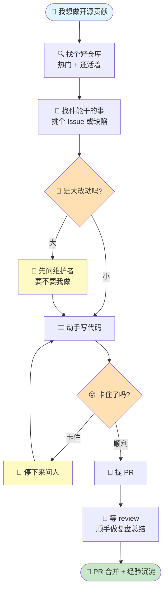

# 流程图（一眼看懂）

给 AI Agent 开源项目做贡献，就是一条闯关路线：从"想做"走到"沉淀成经验"。黄色格子是要**停下来问人**的地方。

```mermaid
flowchart TD
    Start([🙋 我想做开源贡献]) --> S1[🔍 找个好仓库<br/>热门 + 还活着]
    S1 --> S2[🎯 找件能干的事<br/>挑个 Issue 或缺陷]
    S2 --> Ask1{🤔 是大改动吗?}
    Ask1 -->|大| Talk[💬 先问维护者<br/>要不要我做]
    Ask1 -->|小| S4
    Talk --> S4[⌨️ 动手写代码]
    S4 --> Ask2{😵 卡住了吗?}
    Ask2 -->|卡住| Human[🙋 停下来问人]
    Ask2 -->|顺利| S5[🚀 提 PR]
    Human --> S4
    S5 --> S6[👀 等 review<br/>顺手做复盘总结]
    S6 --> Done([🎉 PR 合并 + 经验沉淀])

    style Start fill:#e1f5fe
    style Ask1 fill:#ffe0b2
    style Ask2 fill:#ffe0b2
    style Talk fill:#fff9c4
    style Human fill:#fff9c4
    style Done fill:#c8e6c9
```

对应到详细步骤：🔍找仓库=§1，🎯找事=§2，⌨️写码=§3+§4，🚀提PR=§5，👀跟进=§6。总调度看 `SKILL.md`，每步提示词在 `steps/` 下。
